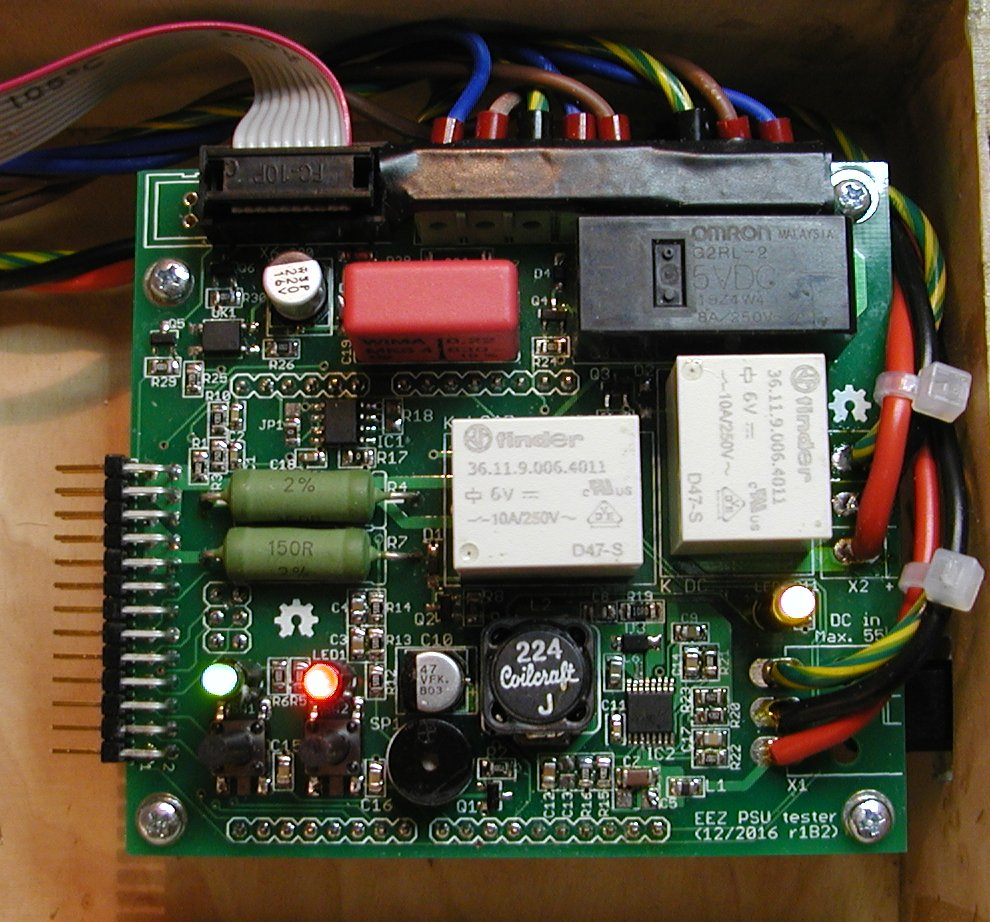

PCB tester for H24005 power supply's Power board and AUX power module that can be used during PCBA and final quality assurance process. Require [Arduino Leonardo](https://www.arduino.cc/en/Main/ArduinoBoardLeonardo) board (attached on the opposite side of the PCB) and sketch with various test cases.

